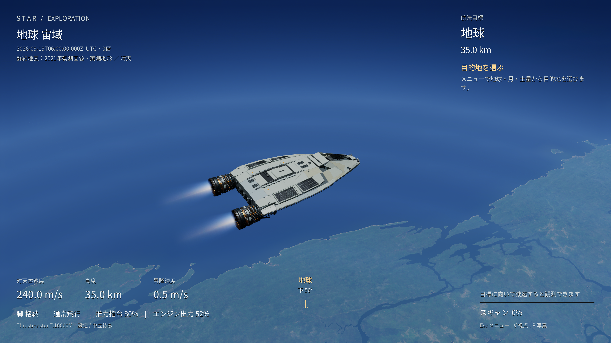

# STAR

**地球を離れて、月へ。土星の環へ。**

公開観測データを使った、日本語の宇宙飛行・探査ゲームです。操縦席から景色を眺めたり、自分で着陸したり、ゆっくり宇宙を巡ったりできます。

実行画面。地表画像・地形の[出典と加工内容](docs/CREDITS.md)。

**自由にいじって、遊んで、作り替えてください。** コードは[MITライセンス](LICENSE)です。Fork、改造、再配布、商用利用も歓迎します。第三者の観測データ・フォントとエンジンにはそれぞれの利用条件があります。[利用条件の整理](THIRD_PARTY_NOTICES.md)をご覧ください。

バイブコーディングで作っている実験的な個人プロジェクトです。完成されたシミュレーターを目指した品質保証はありませんが、動くところから触って広げられるように公開しています。不具合報告や小さな改善も歓迎します。

[ダウンロード](https://github.com/dj-thank/STAR/releases) · [遊び方](docs/PLAYING.md) · [ビルド](docs/BUILDING.md) · [改造・参加](CONTRIBUTING.md) · [素材の出典](docs/CREDITS.md)

## できること

- 地球・月・土星を一つの宇宙で自由飛行。現在地からのガイド航行と手動操縦。
- Cで周辺巡航。地球上空では最大20 km/s、地表に近づくと速度を制限。
- 探査船の操縦席と三人称視点を切り替え。
- 同じ航海を続けながら見る地球上空、夜景、朝日・夕焼け。景色専用の開始モードはありません。
- 地球・大気からの反射光と、日没後の露出順応。[光と昼夜の扱い](docs/LIGHTING.md)。
- 月面への着陸、船外活動、観測・発見記録、写真撮影。
- 飛行位置と設定を保存し、続きから再開。
- 停止・読込の原因を調べる[ローカル飛行ログ](docs/DIAGNOSTICS.md)。外部への自動送信はありません。
- 2026年のUTC日時を変更。固定・1倍・60倍・600倍で天体の位置と姿勢を更新。
- 飛行位置に応じて公開衛星画像と実測地形をオンラインで読み込み。
- キーボード、ゲームパッド、フライトスティックに対応。T.16000M向けの設定あり。
- PC VRモード。Quest Link / Air Link向けの実験的なOpenXR対応。
- 再生成・改変・再配布できるオリジナルの効果音と環境音楽。

## 遊ぶ

[Releases](https://github.com/dj-thank/STAR/releases)のWindows版をダウンロードし、すべて展開して `Play-STAR.cmd` を開いてください。EXEだけを抜き出さず、フォルダー全体を保管してください。ソースのZIPはゲーム実行版とは別です。

対象はWindows 11 / 64 bit / DirectX 12対応GPUです。開発時の描画目標は4K・30fpsですが、GPUや場面により変わります。初期設定は1920×1080です。環境に合わせて調整してください。詳細地表の取得にはインターネット接続とキャッシュ用の空き容量が必要です。

VRは `Play-STAR-VR.cmd` を使います。PCに対応OpenXRランタイムを設定し、ヘッドセットを接続してください。Quest単体版ではありません。**ヘッドセットでの両眼表示・追従・操作・性能は未検証です。**

## データと表現

天体配置は公開の天体暦、地球や月の表面は衛星観測に基づきます。地球の詳細画像は2021年の合成画像で、ゲーム内の日時に合わせて現在の街並みや天気へ変わるものではありません。建物単位の立体再現や、世界全地点で同じ精細さを保証するものでもありません。

取得できない地域では全球表示を使います。高速航行、探査船、操作補助、音はゲーム用の表現です。観測データと補完・演出の区別は[出典](docs/CREDITS.md)に記載しています。

## 自分で変える

Unreal Engine 5.8.2とC++ビルド環境が必要です。大きな素材はGit履歴へ入れず、Releaseの `STAR-Content.zip` と `STAR-Art-Sources.zip` に分けています。[ビルド手順](docs/BUILDING.md)に沿って取得してください。

| 場所 | 内容 |
| --- | --- |
| `Source/Star/Simulation` | 座標・飛行・天体運動 |
| `Source/Star/Runtime` | ゲーム進行、日時、VR |
| `Source/Star/Terrain` | 地形と公開データの読み込み |
| `Source/Star/UI` | 日本語メニューとHUD |
| `Source/Star/Presentation` | 音・描画の制御 |
| `Shaders/Star` | 天体・大気・雲のシェーダー |
| `Tools` / `Tests` | 素材生成、ビルド、検証 |

UIの改善、好きな操縦感への調整、別の探査船への差し替えなど、小さな変更からどうぞ。エンジンを使わないC++テストも用意しています。

## English

STAR is an experimental, Japanese-language space exploration game for Windows. Fly between Earth, the Moon and Saturn, land on the Moon, and explore observational planetary data. The original code is MIT licensed: forks, modifications and redistribution are welcome. Third-party data and Unreal Engine retain their own terms. See the build guide and license notices before redistributing a modified game.
